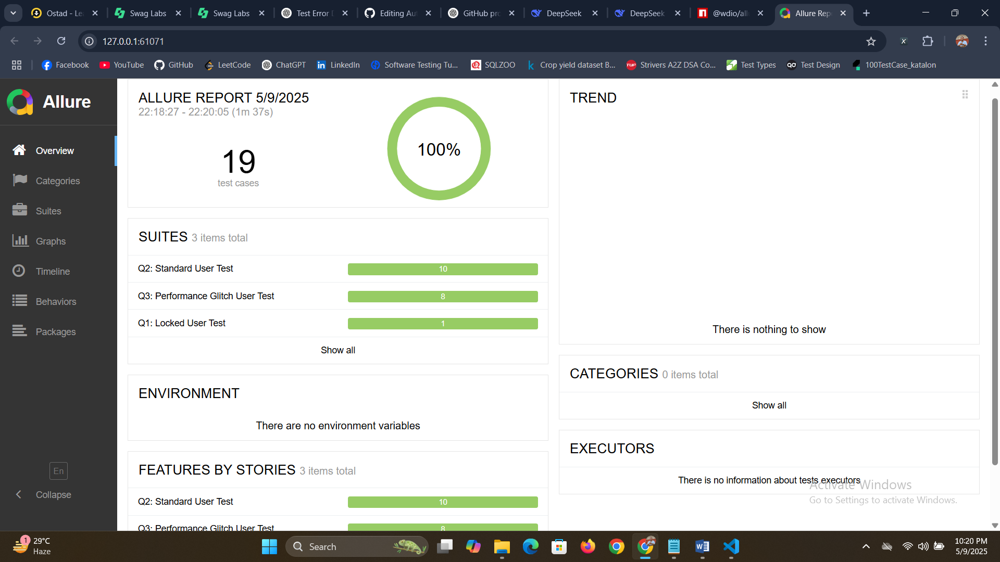

# 🚀 Automation Testing Assessment – Saucedemo.com
This project contains WebdriverIO automation test scripts for [Swag Labs E-commerce Website](https://www.saucedemo.com) as part of an assessment.

## 🛠 The project uses:
- WebdriverIO
- JavaScript
- Mocha (test framework)
- Allure Reporter (for detailed test reports)
- Node.js & NPM
## 📁 Project Structure
```bash
Automation_Project2/
├── test/
│ ├── specs/ # Test scenarios (Q1, Q2, Q3)
│ ├── pageobjects/ # Page Object Model (POM)
│ ├── pageActions/ # Page actions encapsulated as methods
├── wdio.conf.js # WebdriverIO configuration
├── package.json # NPM scripts and dependencies
├── .gitignore
├── README.md # You're reading it!
```
## ⚙️ Setup Instructions
1. Clone the Repository
```bash
git clone https://github.com/kibria282096/Automation_Project_002.git
cd Automation_Project_002
```
2. Install Project Dependencies
```bash
npm install
```
3. Install Allure CLI (if not installed globally)
```bash
npm install -g allure-commandline --save-dev
```
## ▶ Run All Tests Sequentially (Q1 → Q2 → Q3 → Allure report)
```bash
npm run test:full
```
## ▶ Run Individual Test Suites with allure report
Q1 – Locked Out User Test with allure report
```bash
npm run test:q1
```
Q2 – Standard User Checkout Flow with allure report
```bash
npm run test:q2
```
Q3 – Performance Glitch User Test with allure report
```bash
npm run test:q3
```
## ✅ Test Scenarios Breakdown
### 🔹 Q1 – Locked Out User Login

- Login with locked_out_user

- Verify error message is displayed correctly

### 🔹 Q2 – Standard User Full Checkout Flow

- Login with standard_user

- Reset App State from the menu

- Add any 3 items to the cart

- Verify product names and total price

- Complete the purchase

- Verify successful order message

- Reset App State and log out

### 🔹 Q3 – Performance Glitch User Test

- Login with performance_glitch_user

- Reset App State

- Sort products by name (Z to A)

- Add the first product to the cart

- Verify product name and total price

- Complete the purchase

- Verify successful order message

-Reset App State and log out

## 📊 View Allure Report


## ▶ Full test journey automation video

## 🧾 Notes
- Ensure you have Chrome installed and up to date
- You can update the browser settings or selectors in wdio.conf.js if needed
- All tests use explicit waits and POM for maintainability
## 👤 Author
MD ASHADUL KIBRIA
